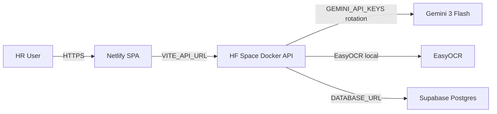

# Deployment Guide

Production topology (free tier): **React on Netlify**, **FastAPI on Hugging Face Spaces (Docker)**,
**PostgreSQL on Supabase**, **Gemini 3 Flash** with multi-key failover.

| Component | Free host | Notes |
| --- | --- | --- |
| Frontend | **Netlify** | Static React build; `netlify.toml` at repo root |
| Backend | **HF Space (Docker)** | Port **7860**; cold start ~30–60s |
| Database | **Supabase** | Run `backend/supabase_migration.sql` |
| AI | **Google AI Studio** | `gemini-3-flash`; rotate keys via `GEMINI_API_KEYS` |

> **Render** (paid) is optional — see section at bottom if you prefer it over HF Spaces.

---

## 1. Supabase (database)

1. Create a project at [supabase.com](https://supabase.com).
2. Open **SQL Editor** and run the full script from `docverify/backend/supabase_migration.sql`.
3. Copy the **Session pooler** connection string (Settings → Database).
4. Set as `DATABASE_URL` on the backend.

---

## 2. Hugging Face Space (backend)

1. Create a **Docker Space** at [huggingface.co/new-space](https://huggingface.co/new-space)
   (deployed example: [`Monike123/Extraction_validate`](https://huggingface.co/spaces/Monike123/Extraction_validate)).
2. Push `docverify/backend/` as the Space root (or symlink via monorepo with `README.md` pointing to backend).
3. The included `Dockerfile` exposes port **7860** — HF Spaces maps this automatically.

### Space secrets (Settings → Variables and secrets)

| Secret | Value |
| --- | --- |
| `DATABASE_URL` | Supabase pooler URL |
| `GEMINI_API_KEYS` | `key1,key2,key3,key4` (comma-separated, **never commit**) |
| `GEMINI_MODEL` | `gemini-3-flash` |
| `CORS_ORIGINS` | Your Netlify URL, e.g. `https://docverify.netlify.app` |
| `API_KEY` | Optional shared demo key |
| `MAX_UPLOAD_BYTES` | `10485760` |
| `EASYOCR_GPU` | `false` |

4. Note your Space URL: `https://Monike123-extraction-validate.hf.space` (or your Space’s public API URL from the Space page).
5. First request after sleep may take **30–60s** (EasyOCR model download).

### Health check

`GET https://YOUR_USERNAME-docverify-api.hf.space/health` → `{"status":"ok"}`

---

## 3. Netlify (frontend)

1. Connect your Git repo to [Netlify](https://netlify.com).
2. Use root `docverify/netlify.toml`:
   - **base:** `docverify/frontend`
   - **build:** `npm run build`
   - **publish:** `dist`
3. Set environment variables:

| Key | Value |
| --- | --- |
| `VITE_API_URL` | `https://Monike123-extraction-validate.hf.space` (no trailing slash) |
| `VITE_API_KEY` | Same as backend `API_KEY` if set |

4. Deploy, then add the Netlify URL to backend `CORS_ORIGINS` and redeploy the Space.

---

## 4. Smoke test checklist

- [ ] Login → Upload `test_documents/pan_1.jpg` → Result shows **AI Powered** + forgery score
- [ ] Dashboard stats populate
- [ ] Review queue works
- [ ] Mobile: hamburger nav + bottom bar on phone browser
- [ ] Gemini audit fields persisted in Supabase (`gemini_raw_json`, `forgery_score`, etc.)

---

## 5. Security

- Store API keys only in **environment variables** — never in git, plan files, or `token.txt`.
- Revoke any keys pasted in chat and regenerate at [Google AI Studio](https://aistudio.google.com/apikey).
- Uploads restricted to **JPG, PNG, PDF** with magic-byte validation.
- Optional `API_KEY` header protects public demo endpoints.

---

## 6. Gmail SMTP (optional)

For experience-letter email verification:

1. Enable 2-Step Verification on your Gmail account.
2. Create an App Password at https://myaccount.google.com/apppasswords
3. Set on HF Space: `SMTP_HOST=smtp.gmail.com`, `SMTP_PORT=587`, `SMTP_USER`, `SMTP_PASS`

Without SMTP, experience verification runs in **demo mode** (no email sent).

---

## Optional: Render (paid alternative)

If you need always-on backend without HF cold starts:

- Root directory: `docverify/backend`
- Runtime: Docker
- Instance: Standard (~2 GB RAM) for torch/opencv
- Health: `/health`
- Set same env vars as HF Space; use persistent disk for SQLite if not using Supabase

See legacy `render.yaml` in `docverify/backend/` if present.

---

## Local development

See [LOCAL_DEMO.md](LOCAL_DEMO.md) for two-terminal local run with `test_documents/`.
