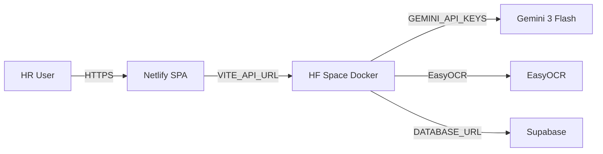

# DocVerify AI

Enterprise HR document verification: extract, validate, mask PII, and detect forgery on Indian identity
and employment documents.

**Supported types:** Aadhaar, PAN, Caste Certificate, Experience Letter, Education Certificate, Resume, General.

- EasyOCR text extraction + field validators
- Gemini 3 Flash vision layer (multi-key failover, JSON-only output)
- Blended confidence scoring (70% AI + 30% rules)
- Full audit trail in Supabase (`gemini_raw_json`, forgery scores, masked images)
- White enterprise UI with mobile navigation
- Send-only employer verification for experience letters (optional Gmail SMTP)

> Demo / portfolio project. Not for real identity decisions.

## Live demo

| Service | URL |
| --- | --- |
| Frontend (Netlify) | `https://YOUR_SITE.netlify.app` |
| API (HF Space) | `https://YOUR_USERNAME-docverify-api.hf.space` |

Fill in after deploying — see [DEPLOYMENT.md](DEPLOYMENT.md).

## Architecture



| Layer | Tech |
| --- | --- |
| Frontend | React 19 + Vite + TypeScript, Netlify |
| Backend | FastAPI, SQLAlchemy, HF Spaces Docker |
| ML | EasyOCR, Gemini 3 Flash, OpenCV, PyMuPDF |
| Database | Supabase PostgreSQL (SQLite for local dev) |

## Quick start (local)

See [LOCAL_DEMO.md](LOCAL_DEMO.md) for full walkthrough.

```powershell
# Terminal 1 — backend
cd docverify\backend
.\.venv\Scripts\uvicorn main:app --reload --port 8000

# Terminal 2 — frontend
cd docverify\frontend
npm run dev
```

Open http://localhost:5173 and upload samples from `test_documents/`.

## Test documents

| File | Type |
| --- | --- |
| `aadhaar_1.jpg` | Aadhaar |
| `pan_1.jpg` | PAN |
| `caste_certificate.pdf` | Caste |
| `experience_letter.pdf` | Experience |
| `education_sample.pdf` | Education |

**Upload formats:** JPG, JPEG, PNG, PDF only.

## API

- `POST /upload` — file + doc_type
- `POST /analyze/{doc_id}`
- `GET  /status/{doc_id}` · `GET /documents` · `GET /queue` · `GET /dashboard`
- `POST /verify-experience/{doc_id}`
- `POST /manual-review/{doc_id}`

## Tests

```powershell
cd docverify\backend
.\.venv\Scripts\pip install -r requirements-dev.txt
.\.venv\Scripts\python -m pytest tests\ -v
```

## Deploy (free tier)

1. **Supabase** — run `backend/supabase_migration.sql`
2. **HF Space** — Docker backend with secrets (see [DEPLOYMENT.md](DEPLOYMENT.md))
3. **Netlify** — frontend with `VITE_API_URL` pointing to HF Space
